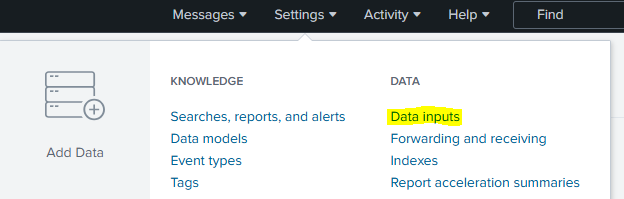
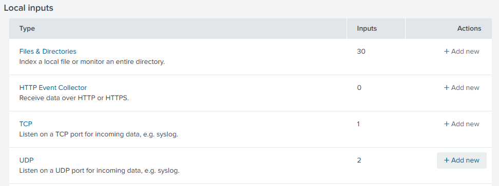
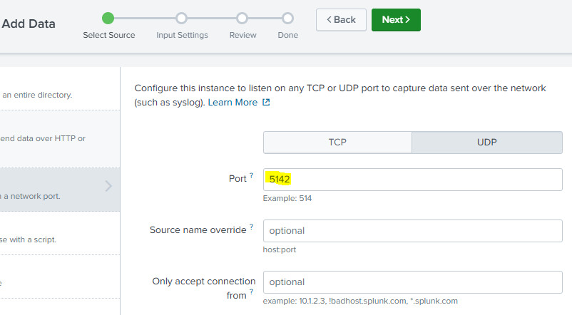
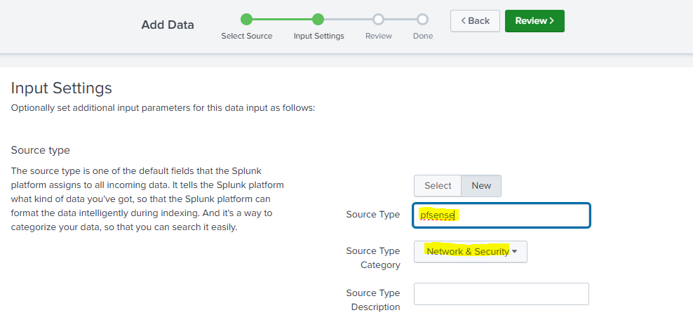
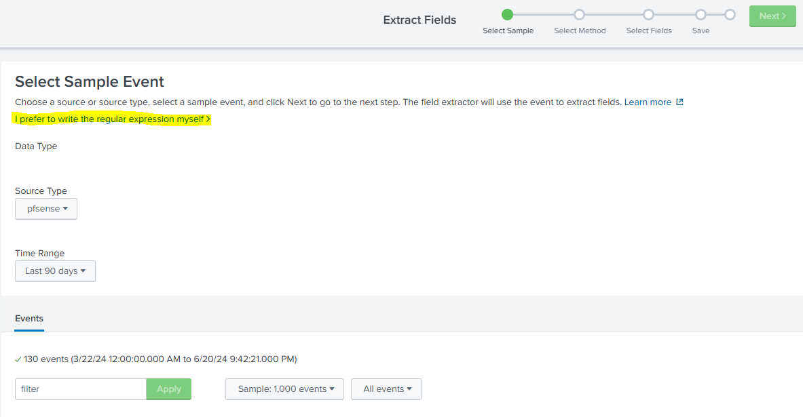
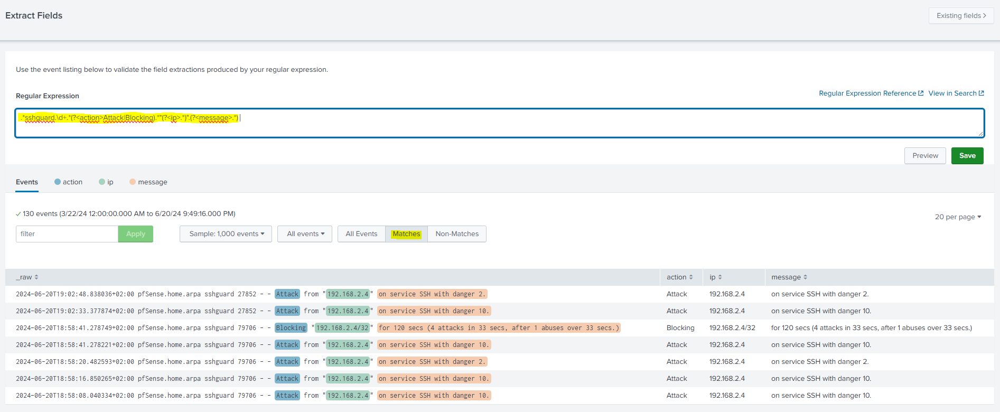

# SPLUNK data extraction templates for pfSense


Splunk is a powerful platform for searching, monitoring, and analyzing machine-generated data in real-time and the industry-standard in SIEMs. It collects and indexes logs and event data from various sources, making it easy to search and visualize patterns, detect anomalies, and find evil or troubleshoot issues. 

## SSHguard

SSHguard informs us mainly about filed logins. To extract event date from those log lines use:

```RegExp
.*sshguard.\d+.*(?<action>Attack|Blocking).*"(?<ip>.*)".(?<message>.*)
```

## Filterlog IPv4

This messages will by default contain only blocked connections but if you set it up, you can recive also logs with allowed connections.

The IPv4 log-lines can be ingested with:

```RegExp
.*filterlog.*,(?<interface>em[0-3]),.*,(?<action>pass|block),.*,(?<protocol>tcp|udp|TCP|UDP),.*,(?<src_ip>(\d+\.\d+\.\d+\.\d+)),(?<dest_ip>(\d+\.\d+\.\d+\.\d+)),(?<src_port>(\d*)),(?<dest_port>(\d*))
```

Sadly the fields and order of fields are a bit different win IPv6 - so we need to have another filter for those...

## Filterlog IPv6

The IPv6 log-lines can be ingested with:

```RegExp
.*filterlog.*,(?<interface>em[0-3]),.*,(?<action>pass|block),.*,(?<protocol>tcp|udp|TCP|UDP),.*,(?<src_ip_v6>([a-f\d]+:.*:[a-f\d]+)),(?<dst_ip_v6>([a-f\d]+:.*:[a-f\d]+)),(?<src_port>(\d*)),(?<dest_port>(\d*))
```

## Suricata

Suricata IDS alerts can be ingested with this reg. expression:

```RegExp
.*nginx.-.*-.*-.(?<client_ip>.*).-.*-.\[(?<timestamp>\d+/[A-Za-z]{3}/\d+:\d+:\d+:\d+.\+\d+)\]."(?<http_method>[A-Z]+).(?<path>[^\s]+)\s(?<http_version>HTTP/\d\.\d)".(?<status_code>\d+).\d+."(?<url>.*)"."(?<user_agent>.*)"
```

## NGINX

Nginx logs contain informations about web-ui usage

```
.*nginx.-.*-.*-.(?<client_ip>.*).-.*-.\[(?<timestamp>\d+/[A-Za-z]{3}/\d+:\d+:\d+:\d+.\+\d+)\]."(?<http_method>[A-Z]+).(?<path>[^\s]+)\s(?<http_version>HTTP/\d\.\d)".(?<status_code>\d+).\d+."(?<user_agent>.*)"
```

## How to receive syslog messages with SPLUNK

1. Klick on `Settings` -> `Data inputs`  
   

2. Klick on the `+ Add new` button next to `UDP`  
   

3. Add a port-number in the form and chick the `Next>` button  
     
   I use another port for each of the syslog inputs to define a speciffic `Source Type` for 

4. Create a new `Source Type` and set the `Source Type Category` to `Network & Security`  
   

5. Klick on the `Review>` button and then on the `Submit` button.

## How to setup pfSense to send syslog messages to SPLUNK

1. Open `Status` -> `System Logs` -> `Settings` on the pfSense web interface:

2. Set the "Syslog format" to: `syslog (RFC 5424, with RFC 3339 microsecond-precision timestamps)`

3. Enter `IP:PORT` in the first "Remote log servers" field - e.g.: `192.168.2.2:5141`. Set the IP and port according to your environment.

4. Make sure the firewall is not blocking those traffic!

## How to setup the extraction with RegExp

1. Run a search to find log messages with the correct data type - e.g.: `pfsense sshguard` and then click on `+ Extract New Fields` below the list of fields.

2. Select the correct `Source Type` and click on `I prefer to write the regular expression myself>`  
   

3. Paste the regular expression mentioned above into the field, click the `Preview` button and select `Matches`  
   

4. If the results show the correct data extracted, click on the `Save` and then on the `> Finish` button.

